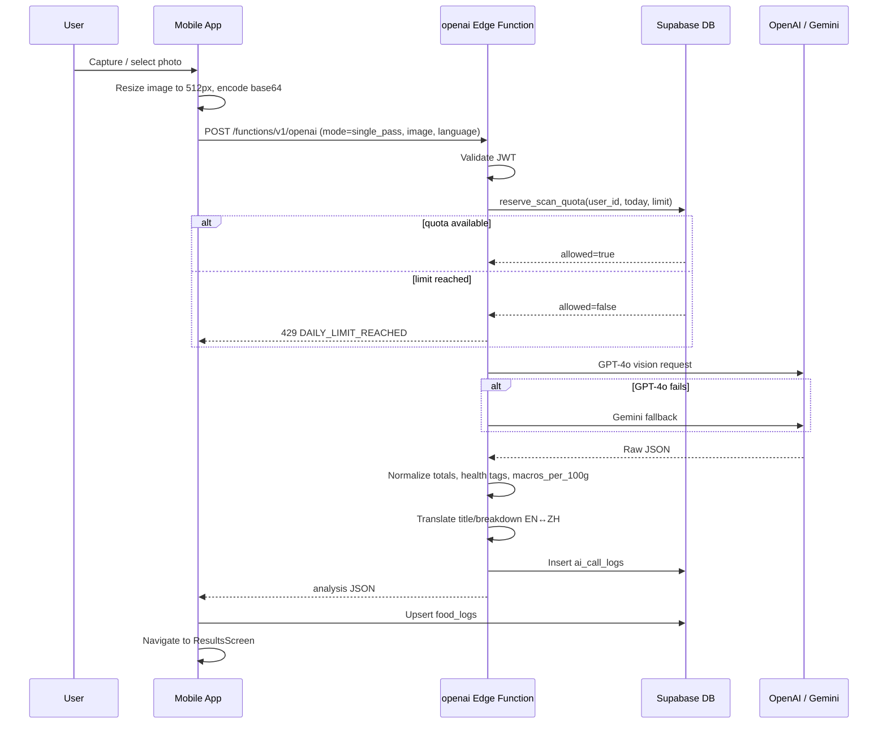

# Technical Design Document: NouriSnap.ai (Forkcast)

## 1. Document Metadata

| Field | Value |
|---|---|
| **Project / Feature Name** | NouriSnap.ai / Forkcast — AI-Powered Meal Nutrition Analysis |
| **Author(s)** | [Your Name / Team] |
| **Status** | Draft |
| **Created Date** | 08-26-2026 |
| **Last Updated** | 08-26-2026 |
| **Project Management Link** | [JIRA / Linear / GitHub Issue link] |

---

## 2. Overview & Summary

### High-Level Summary
NouriSnap.ai (also referred to as **Forkcast**) is a cross-platform mobile application that lets users capture or select a photo of a meal and receive an AI-generated nutritional breakdown, including calories, macronutrients, sodium, sugar, fiber, and a health score. The app is built with **React Native + Expo**, backed by **Supabase** (Auth, Postgres, Edge Functions, and Storage), and uses **OpenAI GPT-4o** as the primary vision model with a **Gemini** fallback. The system supports bilingual output (English and Traditional Chinese), enforces per-user daily scan quotas server-side, stores a persistent meal history, and derives personalized nutrition targets from a short onboarding questionnaire.

### Background / Context
Manual food logging is tedious and error-prone: users must search databases, estimate portions, and weigh ingredients. By using a multimodal large language model, NouriSnap lowers the friction of logging a meal to a single photo. The project is also building toward a consented training dataset for improved food recognition, while managing API costs and respecting user privacy through explicit opt-in and server-side quota enforcement.

---

## 3. Goals & Scope

### Goals (In-Scope)

| # | Goal |
|---|---|
| 1 | Allow users to analyze meals from camera capture or gallery selection with minimal taps. |
| 2 | Provide portion-aware estimates and let users refine ingredient lists before final analysis. |
| 3 | Track daily and historical nutrition intake against personalized targets. |
| 4 | Support English and Traditional Chinese (Taiwan) UI and content. |
| 5 | Enforce per-user daily scan limits to control AI API costs. |
| 6 | Store meal history securely with row-level security and auditable AI call logs. |
| 7 | Generate health scores and tags aligned with Taiwan HPA / USDA nutrition guidance. |

### Non-Goals (Out-of-Scope)

| # | Non-Goal | Rationale |
|---|---|---|
| 1 | Real-time continuous tracking / wearable integration | Outside current MVP scope; can be added later via device APIs. |
| 2 | Social sharing / community features | Increases privacy surface and is not required for core nutrition logging. |
| 3 | Full offline AI analysis | Vision LLMs require network; only offline photo queuing is supported. |
| 4 | Medical prescriptions or clinical diet plans | App provides informational estimates only, not medical advice. |

---

## 4. Proposed Architecture & System Design

### High-Level Design

```mermaid
flowchart LR
    subgraph Mobile_App ["Mobile App (React Native / Expo)"]
        A[Camera / Gallery]
        B[Analysis Loading]
        C[Results / History]
        D[Dashboard]
    end

    subgraph Supabase ["Supabase Cloud"]
        E[Auth / JWT]
        F[Postgres DB]
        G[Edge Functions]
        H[Storage: food-images]
    end

    subgraph AI_Providers ["AI Providers"]
        I[OpenAI GPT-4o]
        J[Google Gemini]
    end

    A -->|base64 image| B
    B -->|supabase.functions.invoke('openai')| G
    G -->|primary| I
    G -->|fallback| J
    G -->|reserve/ release quota| F
    G -->|log scan| F
    G -->|store image (if consented)| H
    B --> C
    C -->|food_logs| F
    D -->|read totals| F
    E -->|JWT| B
```

### Component Breakdown

| Component | Responsibilities | Key Inputs | Key Outputs |
|---|---|---|---|
| **Mobile App (`App.tsx`, screens)** | Routing, auth gating, deep-link handling, offline banner, font/theme/i18n bootstrapping. | User session, deep links, network state. | Rendered UI, navigation events. |
| **Auth Context (`src/context/AuthContext.tsx`)** | Exposes current Supabase session and listens to auth state changes. | Supabase auth events. | `session`, `supabase` client. |
| **Meal Capture (`MealCaptureScreen`, `CameraComponent`)** | Capture or pick meal photo, request permissions, pass URI to analysis. | Camera/gallery URI. | `imageUri`, `mealType`, etc. |
| **Analysis Orchestrator (`AnalysisLoadingScreen`, `useRunAnalysis.ts`)** | Validates quota, fetches access token, calls AI, validates response, navigates to results or retry. | `imageUri`, `query`, `foodBreakdown`, `foodType`, `language`, etc. | `FoodAnalysis` object, navigation commands. |
| **Breakdown Confirmation (`BreakdownConfirmScreen`)** | Lets users edit AI-generated ingredient lists, portions, and drink sugar levels before final analysis. | `breakdown` items, confidence flags. | Refined `foodBreakdown`, `portion`, `sugarLevel`. |
| **API Service (`src/services/api.ts`)** | All Supabase/Edge Function calls: settings, food logs, history, targets, photo uploads. | User IDs, payloads. | Typed records (`HistoryLogItem`, `UserSettingsRecord`, `FoodAnalysis`). |
| **Health Metadata Utility (`src/utils/calculateHealthMetadata.ts`)** | Pure functions mapping AI/server health scores and nutrition values to UI tags/stages. | Nutrition numbers, score. | Health tags, stage labels, colors. |
| **OpenAI Edge Function (`supabase/functions/openai/index.ts`)** | Auth guard, rate limiting, quota reservation, model calls, JSON normalization, translation, image storage. | HTTP request with JWT, image/query payload. | JSON analysis/breakdown/translation. |
| **Delete-User Edge Function (`supabase/functions/delete-user/index.ts`)** | Securely deletes the authenticated user via service-role admin client. | JWT. | Success/error response. |

### Data Flow / Sequence (Photo Scan)



---

## 5. Data Model & Storage

### Database Schema Changes

The schema is managed via Supabase migrations in `supabase/migrations/`.

#### `public.user_settings`

| Column | Type | Notes |
|---|---|---|
| `user_id` | uuid | FK → `auth.users(id)`, primary key via upsert |
| `age`, `weight_kg`, `height_cm` | numeric | From onboarding questionnaire |
| `sex` | text | `male` / `female` |
| `activity_level` | text | `sedentary`, `light`, `moderate`, `active`, `very_active` |
| `goal` | text | `maintain`, `lose`, `gain` |
| `calorie_target`, `protein_target_g`, `carb_target_g`, `fat_target_g` | numeric | Computed via Mifflin–St Jeor + activity/goal multipliers |
| `sodium_target_mg`, `sugar_target_g`, `fiber_target_g` | numeric | Default targets per health guidelines |
| `data_collection_consent` | boolean | GDPR/App Store opt-in for AI training dataset |

#### `public.food_logs`

| Column | Type | Notes |
|---|---|---|
| `id` | uuid | Primary key |
| `user_id` | uuid | FK → `auth.users(id)` ON DELETE CASCADE |
| `image_url` | text | Local/remote image reference |
| `meal_type` | text | `breakfast`, `lunch`, `dinner`, `snack` |
| `recorded_for_date` | date | Logical meal date |
| `calories`, `protein_g`, `carbs_g`, `fat_g`, `sodium_mg`, `sugar_g`, `fiber_g` | numeric | Denormalized totals |
| `title`, `title_en`, `title_zh` | text | Dish title + translations |
| `breakdown_en`, `breakdown_zh` | text | Ingredient narrative translations |
| `health_score` | decimal | 0–10 score |
| `health_recommendation` | text | Single-sentence advice |
| `food_json` | jsonb | `food_breakdown`, `tip_or_fact`, `suggestion`, feedback, edit_tracking |
| `idempotency_key` | text | Upsert key to avoid duplicate logs |

#### `public.daily_scan_usage`

| Column | Type | Notes |
|---|---|---|
| `user_id` | uuid | FK → `auth.users(id)` |
| `scan_date` | date | `CURRENT_DATE` |
| `scan_count` | integer | Incremented atomically |
| Unique | `(user_id, scan_date)` | Enforces one row per user per day |

Quota enforcement uses the atomic RPCs `reserve_scan_quota` / `release_scan_quota` defined in `supabase/migrations/20260825_atomic_scan_quota.sql`.

#### `public.ai_call_logs`

Stores per-call debugging and evaluation data. Renamed from `openai_call_logs` in `supabase/migrations/20260320_rename_openai_call_logs.sql`.

### Data Storage & Caching

| Layer | Technology | Purpose |
|---|---|---|
| **Primary Database** | Supabase Postgres | Auth, settings, food logs, scan usage, AI call logs. |
| **Object Storage** | Supabase Storage (`food-images` bucket) | Consented meal photos organized by `YYYY/MM/DD/{correlationId}.ext` for future model training. |
| **Client Cache** | `AsyncStorage` + in-memory maps | User settings, daily scan counters, pending offline photos, admin bypass flag. |
| **History Totals Cache** | In-memory object in `src/services/api.ts` | Reduces repeated same-day aggregation. |

---

## 6. API & Interface Design

### Edge Function Endpoints

All AI endpoints are served by the single Supabase Edge Function `openai` (entry point: `supabase/functions/openai/index.ts`). The client invokes it via `supabase.functions.invoke('openai', …)` in `src/services/api.ts`.

#### `POST /functions/v1/openai/classify`

| Field | Type | Description |
|---|---|---|
| `image_base64` | string | JPEG/PNG base64 |
| `mimetype` | string | e.g. `image/jpeg` |

**Response:**
```json
{ "food_type": "drink" }
```
> Values: `drink`, `dish`, `packaged`. GPT-4o primary, Gemini fallback.

#### `POST /functions/v1/openai/translate`

| Field | Type | Description |
|---|---|---|
| `text` | string | Source text |
| `target_language` | string | `en` or `zh-TW` |

**Response:**
```json
{ "translated_text": "..." }
```

#### `POST /functions/v1/openai` (main analysis)

| Field | Type | Required | Description |
|---|---|---|---|
| `mode` | string | Yes | `single_pass`, `breakdown`, `rebreakdown`, `analysis` |
| `image_base64` | string | Conditional | Required for `single_pass` / `breakdown` |
| `query` | string | Conditional | Dish name / text input |
| `food_breakdown` | string | Conditional | JSON string of known breakdown for refine flows |
| `portion` | number | No | Portion multiplier |
| `servings` | number | No | Packaged-food serving count |
| `sugar_level` | number | No | 0–100% sugar for drinks |
| `food_type` | string | No | `drink`, `dish`, `packaged` |
| `language` | string | No | `en` or `zh-TW` |
| `admin_bypass` | boolean | No | Skip daily quota (dev/eval only) |

**Response (mode=single_pass):**
```json
{
  "analysis": {
    "title": "...",
    "food_type": "dish",
    "food_breakdown": "...",
    "items_detailed": [{ "name": "...", "grams_g": 120, "volume_ml": null, "confidence": 0.9, "is_garnish": false, "is_base": true }],
    "foodItems": [{ "name": "...", "calories": 200, "macros": {...}, "macros_per_100g": {...} }],
    "calories": 650,
    "carbs_g": 70, "protein_g": 25, "fat_g": 20,
    "sodium_mg": 800, "sugar_g": 10, "fiber_g": 5,
    "health_tags": ["whole_food", "high_fiber"],
    "health_score": 7.5,
    "health_recommendation": "...",
    "tip_or_fact": "...",
    "suggestion": "..."
  },
  "title_en": "...", "title_zh": "...",
  "breakdown_en": "...", "breakdown_zh": "..."
}
```

### Supabase Client Interfaces

| Operation | Purpose |
|---|---|
| `supabase.rpc('reserve_scan_quota', {...})` | Atomic quota reservation |
| `supabase.from('user_settings').upsert(...)` | Profile + targets |
| `supabase.from('food_logs').upsert(...)` | Save meal |
| `supabase.from('food_logs').select(...)` | History / day detail |

### Authentication & Authorization

- **Client ↔ Supabase:** Standard Supabase Auth JWT, persisted in `AsyncStorage`, PKCE flow, auto-refresh enabled.
- **Client ↔ Edge Function:** JWT passed in `Authorization: Bearer <access_token>`; function verifies via `supabase.auth.getUser(bearer)`.
- **Service Role:** Edge Functions use `SUPABASE_SERVICE_ROLE_KEY` to bypass RLS for quota writes, AI call logs, and image uploads.
- **Admin/eval access:** A bearer token matching the service role key is accepted as `service-role-eval`, bypassing quota.

### Error Handling

| HTTP | Code / Scenario | Client Behavior |
|---|---|---|
| 400 | Missing required fields | Alert, return to capture |
| 401 | Missing/invalid JWT | Redirect to SignIn |
| 413 | Payload too large (`MAX_BODY_CHARS` ~2 MB) | Resize image and retry |
| 429 | `DAILY_LIMIT_REACHED` | Localized alert, redirect to Dashboard |
| 429 | Rate limit (`/classify`, `/translate`) | Back off |
| 500 | AI provider failure | Show generic “analysis failed” with retry/retake |
| 503 | Quota reservation unavailable | Retry prompt |

---

## 7. Tradeoffs, Alternatives & Constraints

### Alternative Solutions Considered

| Alternative | Why Rejected |
|---|---|
| **Client-side-only daily limit** | Trivially bypassable; current design enforces quota server-side in the Edge Function. |
| **Always use OpenAI GPT-4o** | Cost and availability risk; Gemini fallback keeps the app functional if OpenAI is down or rate-limited. |
| **Store every meal photo by default** | Privacy risk; only consented photos are uploaded to the `food-images` bucket. |
| **Single monolithic prompt** | Hard to tune and maintain; current code splits classification, breakdown, and analysis into dedicated prompt modules in `supabase/functions/openai/prompts.ts`. |

### Tradeoffs

| Decision | What We Gained | What We Sacrificed |
|---|---|---|
| GPT-4o primary + Gemini fallback | Higher accuracy and resilience | Added integration complexity, two API keys/billing accounts |
| Server-side quota enforcement | Security / cost control | Extra DB round-trip per scan (~10–20 ms) |
| Client-side image resize to 512px | Lower latency and API cost | Some loss of fine detail for packaged-food labels |
| OpenAI-based translation | Higher quality bilingual output | Added latency and token cost per scan |
| Supabase Edge Functions | Tight integration with Auth/DB/Storage | Vendor lock-in, Deno runtime quirks |

### Constraints

- **Cost:** Default daily scan limit of 5 per user (`DAILY_SCAN_LIMIT` env var).
- **Privacy:** iOS/Android App Store policies require data collection consent; RLS and opt-in storage satisfy this.
- **Tech stack:** Locked into Expo / React Native / Supabase / OpenAI.
- **Mobile runtime:** Camera/photo permissions, offline state, deep-link handling for password reset.

---

## 8. Dependencies & Risks

### Dependencies

| Dependency | Why It’s Needed |
|---|---|
| **Supabase project** | Auth, Postgres, Edge Functions, Storage, RLS |
| **OpenAI API key** | Primary vision + translation model |
| **Gemini API key** | Fallback vision model |
| **Expo Application Services (EAS)** | Build, submit, OTA updates |
| **Apple / Google developer accounts** | App store distribution |

### Risks & Mitigation

| Risk | Likelihood | Impact | Mitigation |
|---|---|---|---|
| OpenAI rate limiting / cost spikes | Medium | High | Daily quotas, image resize, mock mode (`USE_OPENAI_MOCK`), Gemini fallback |
| AI returns inaccurate nutrition | Medium | Medium | Response normalization, totals reconciliation, user edit flow, health-tag filtering |
| User privacy complaints | Low | High | RLS, explicit consent flag, no storage without consent, delete-user function |
| Auth deep-link failures | Low | Medium | PKCE, timeout fallbacks in `App.tsx`, pending route queue |
| Supabase Edge Function cold start latency | Medium | Medium | Keep functions focused, avoid heavy deps, 60s timeout for analysis |
| Data loss if client crashes before log save | Low | Low | `idempotency_key` upserts, pending photo queue on reconnect |

---

## 9. Operational Plan

### Testing Strategy

| Layer | Approach |
|---|---|
| **Unit tests** | Pure utility functions, especially `src/utils/calculateHealthMetadata.ts` (thresholds, tag sorting, score staging). |
| **Edge Function tests** | Validate JSON normalization, quota logic, auth rejection, and fallback behavior against mocked OpenAI/Gemini responses. |
| **Integration tests** | End-to-end mobile flow: capture → analyze → save → view history. |
| **Model evals** | Use `eval/run_eval.py` with repeat runs against the deployed function and prompt version tracking. |
| **QA validation** | Test packaged labels, drinks, Asian cuisine, low-light photos, and bilingual output. |

### Monitoring & Logging

| Source | Metrics / Alerts |
|---|---|
| **Supabase Function Logs** | Errors, cold starts, latency, fallback frequency to Gemini. |
| **`ai_call_logs` table** | Per-call model, token usage, prompt version, correlation ID. |
| **`daily_scan_usage` table** | Quota consumption patterns, spikes. |
| **Client Sentry / Expo** | Crashes, ANRs, analysis failure rates. |
| **Offline banner telemetry** | Frequency and duration of offline use. |

### Deployment & Rollback

#### Mobile App (EAS)
1. `eas build --profile staging`
2. Internal / TestFlight distribution
3. `eas build --profile production` + `eas submit`
4. **Rollback:** Use EAS “roll back to embedded” or submit previous binary.

#### Supabase Backend
1. `supabase db push` migrations per environment (`dev` / `staging` / `prod`).
2. `supabase functions deploy openai` and `supabase functions deploy delete-user`.
3. Set environment variables via `supabase secrets set --env-file .env.<env>`.
4. **Rollback:** Revert function code to previous commit and redeploy; for DB, write a compensating migration or restore from backup.

#### Env Vars per Environment
- `SUPABASE_URL`, `SUPABASE_ANON_KEY`, `SUPABASE_SERVICE_ROLE_KEY`
- `OPENAI_API_KEY`, `GEMINI_API_KEY`
- `DAILY_SCAN_LIMIT` (default `5`)
- `USE_OPENAI_MOCK` (dev only)
- Optional: `STORE_IMAGES` flag for training dataset uploads

---

## Appendix: Key File References

- Root config: `package.json`, `app.config.js`
- Navigation / app entry: `App.tsx`
- Supabase client: `src/lib/supabase.ts`
- API service: `src/services/api.ts`
- Analysis hook: `src/hooks/useRunAnalysis.ts`
- Daily limit hook: `src/hooks/useDailyLimit.ts`
- Health metadata: `src/utils/calculateHealthMetadata.ts`
- OpenAI Edge Function: `supabase/functions/openai/index.ts`
- Delete-user Edge Function: `supabase/functions/delete-user/index.ts`
- Atomic quota migration: `supabase/migrations/20260825_atomic_scan_quota.sql`
